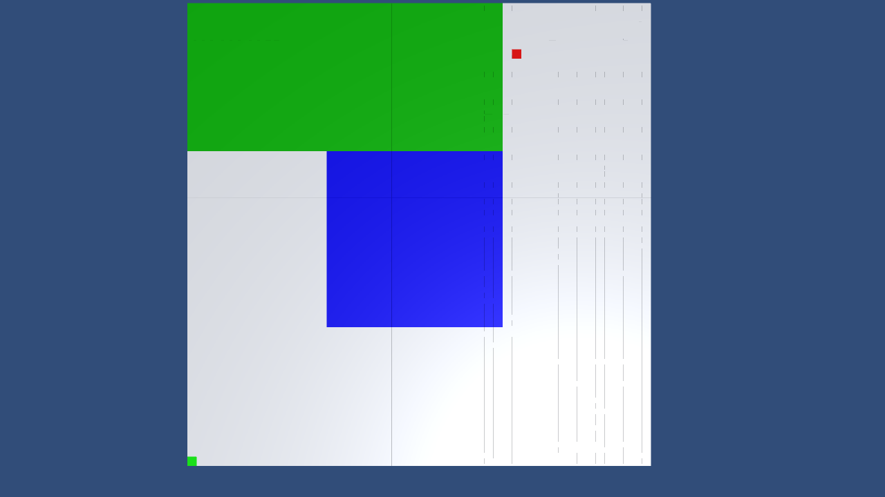
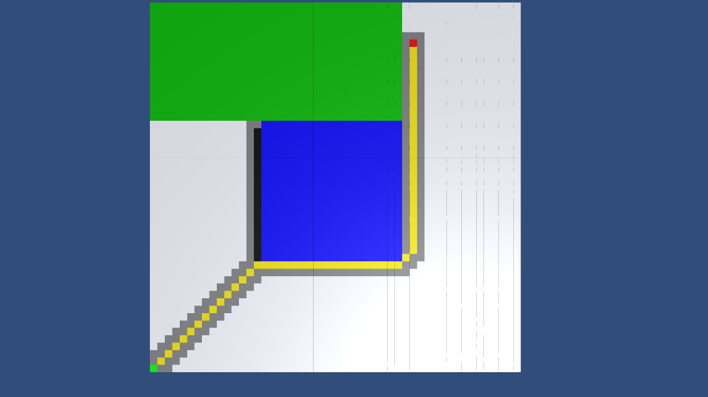
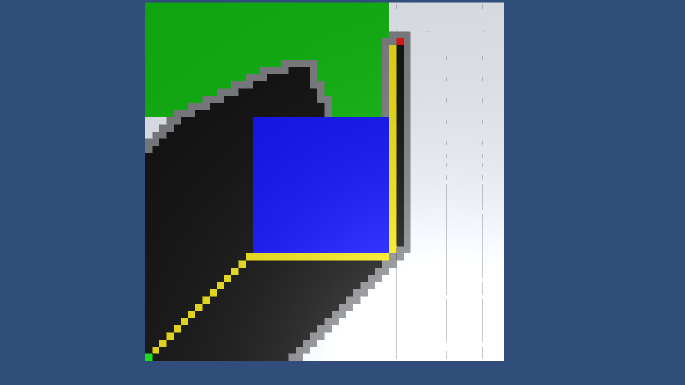
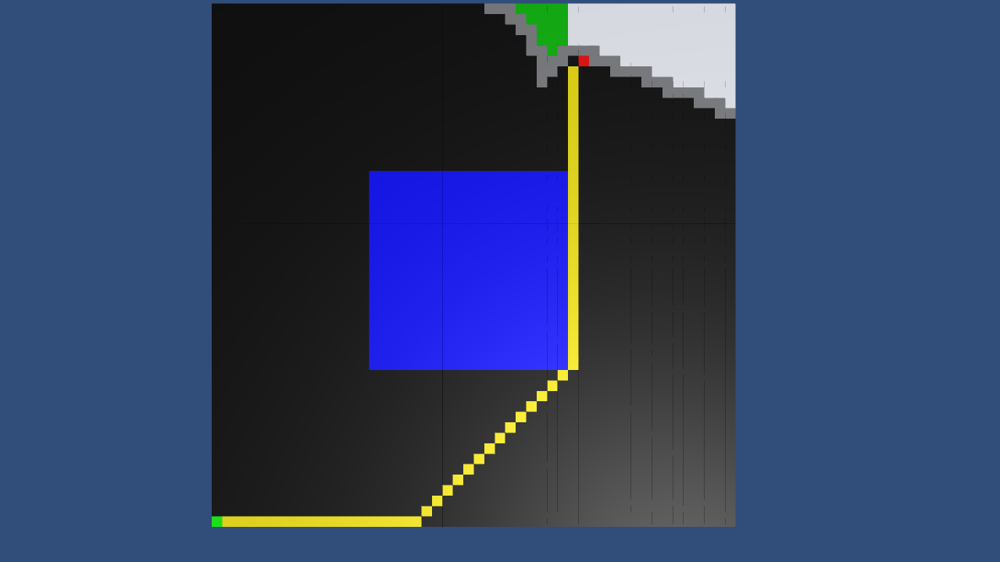
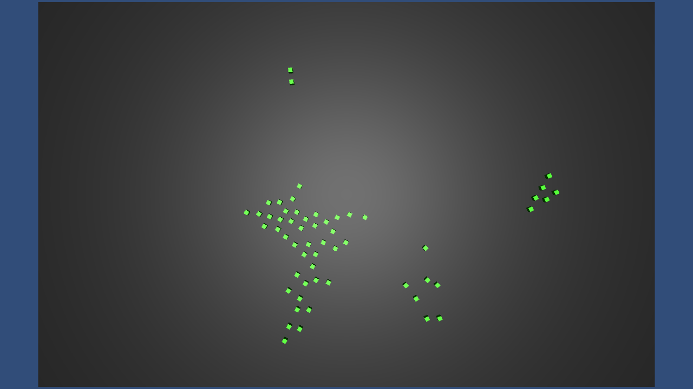

Artificial Intelligence Projects
=======================

I have always had an interest in artificial intelligence, and have therefore tried implementing two different classic algorithms, which have been used in games and animation techniques. These are the A\* search algorithm and the Boids behavior algorithm.

**Table of Contents**
- [A* search algorithm](#a-search-algorithm)
- [Boids](#boids)

A\* search algorithm
--------------------

I have implemented the classic A\* search algorithm in Unity, without any use of the built-in Unity AI components. The algorithm is based on a discrete grid consisting of 1x1x1 blocks each representing a point in the world. Each block can have different "movement weights", representing the difficulty of passing through that area. Three different heuristics are implemented:

-   Manhattan (L1 norm)

-   Diagonal (L2 norm)

-   Djikstra (No heuristic).

Ideally I would like to expand on the code so that it can work with any general surface and not the discrete grid currently used. Furthermore, I would like to expand on it so that it is possible to define the end point by a single mouse-click, as in e.g. StarCraft or other RTS games.

The green spot in the bottom left corner is the start. The red spot is the end. The blue square signifies a giant wall, while the green area signifies an area which takes longer to traverse. The best found route is shown in yellow, and black and gray shows which nodes have and are being considered respectively.

Original map            | Manhattan heuristic
:-------------------------:|:-------------------------:
  |  

Diagonal heuristic             | Djikstra heuristic
:-------------------------:|:-------------------------:
  |  

Boids
-----

I have implemented a version of the Boids algorithm proposed by [Reynolds (1987)](http://doi.acm.org/10.1145/37402.37406), in Unity. However, as with the A\* algorithm, I have not used the built-in AI components in Unity. It is currently restricted to a 2D plane, and world is "warped", meaning that when a boid moves out the left side it appears on the right side again. Currently the boids adhere to 4 different rules: Separation, Coherence, Alignment and Random movement. I do also have plans on implementing collision detection and avoidance, and have different groups of boids which would avoid each other if they are too close. I have however not had time to implement this as of yet.

The Boids algorithm in effect. Four different groupings of boids can be observed           
:-------------------------:
 

